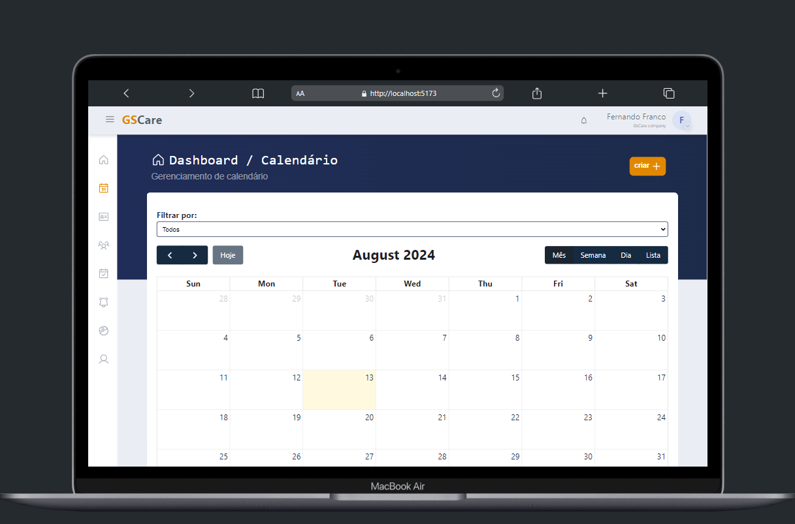
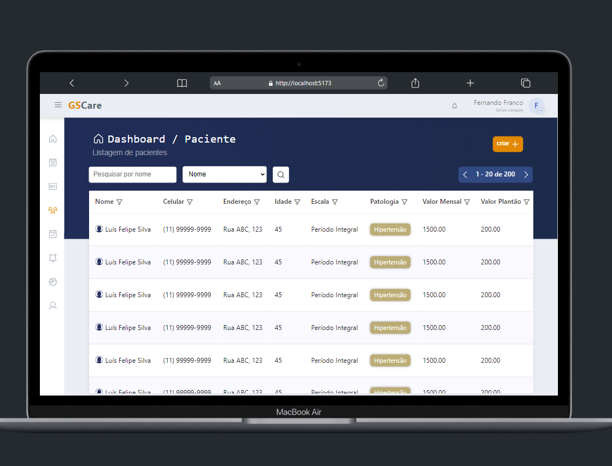
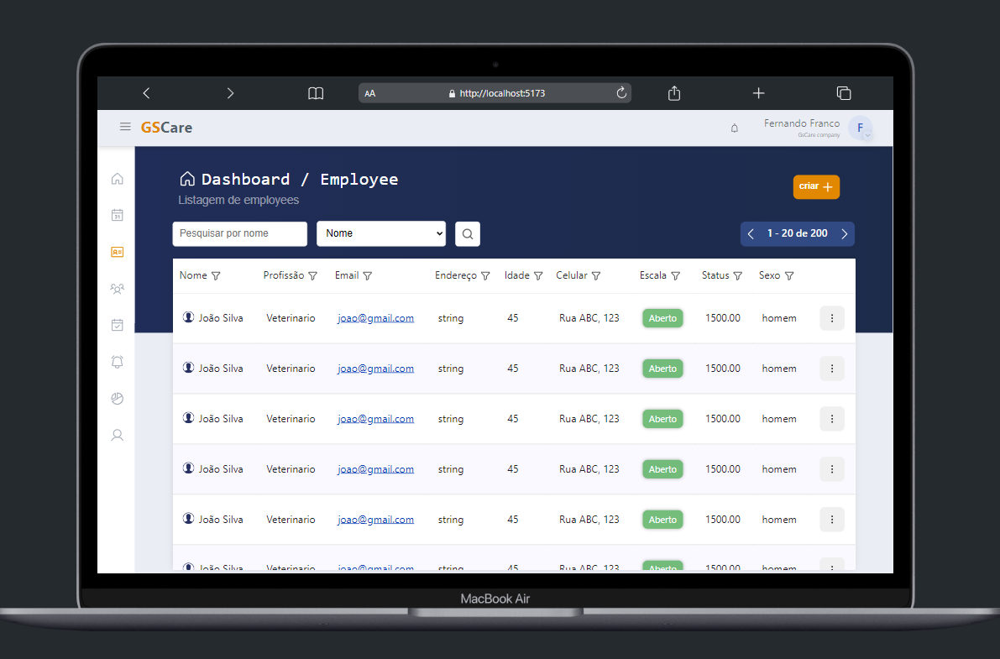
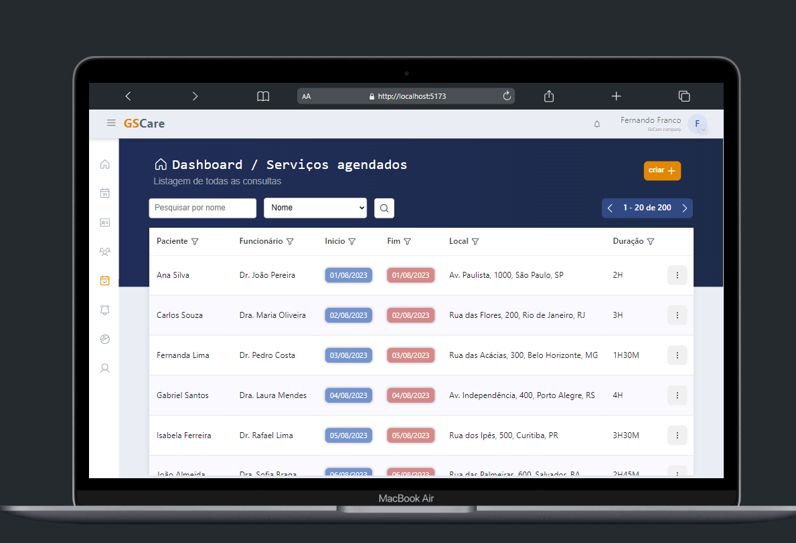
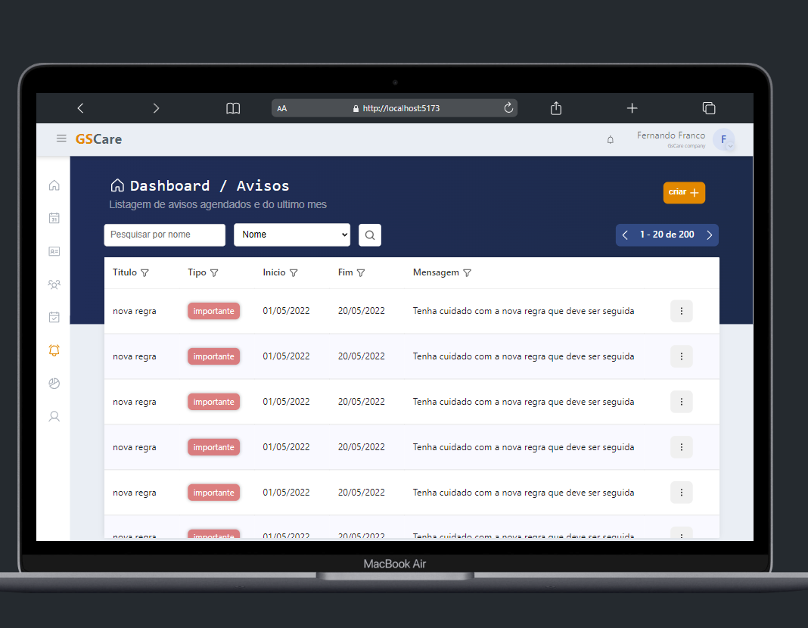
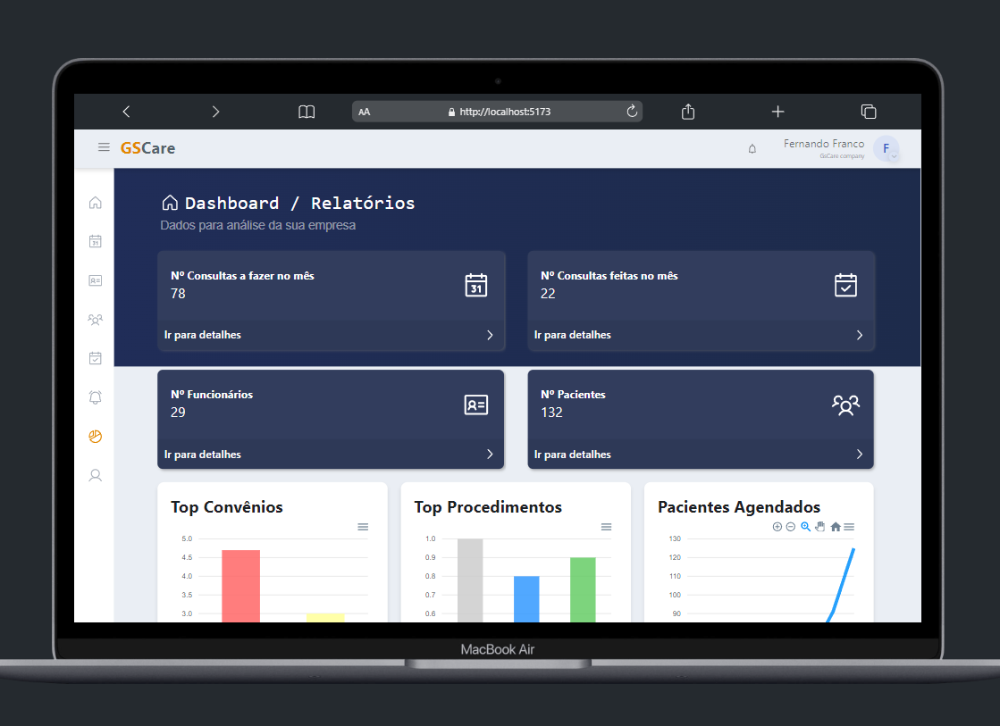
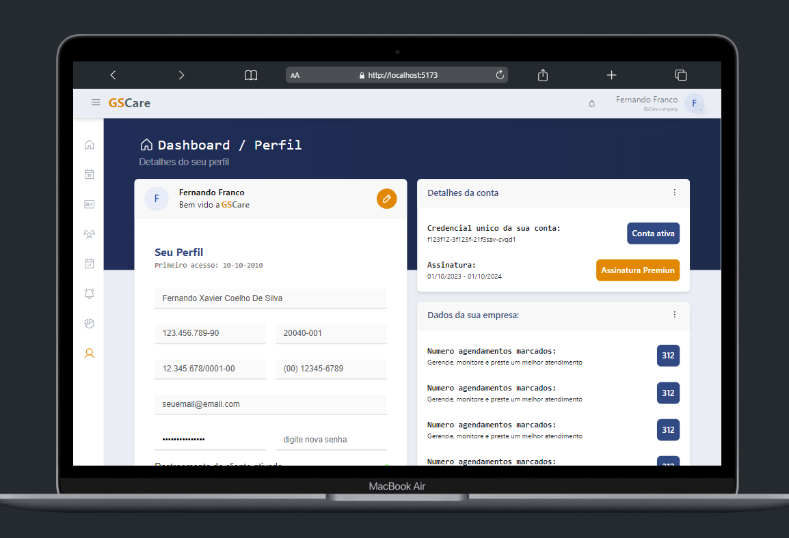

# GSCare Frontend

```Cuidar do seu cliente é cuidar da sua empresa.```

O frontend do GSCare é voltado para o acompanhamento e gerenciamento de clientes e funcionários em empresas prestadoras de serviços, como clínicas e profissionais de saúde. Entre suas funcionalidades, destacam-se o gerenciamento de pacientes, funcionários, agendamentos de calendário, e o armazenamento de fotos e arquivos. O GSCare será oferecido como um Software como Serviço (SaaS).

O frontend é desenvolvido com React, TypeScript e Styled-Components, garantindo uma interface moderna e responsiva.

## 🚀 Começando

Este guia fornecerá instruções para obter uma cópia do projeto frontend em operação na sua máquina local para fins de desenvolvimento e teste.

### 📋 Pré-requisitos

Antes de começar, você precisará ter instalado na sua máquina:

- **Node.js (versão 20)**: Necessário para gerenciar as dependências do projeto. [Instalar Node.js](https://nodejs.org/)

### 🔧 Instalação

Siga os passos abaixo para configurar o ambiente de desenvolvimento:

1. **Clone o repositório:**

   ```bash
   git clone https://github.com/gscare/gscare-frontend.git
   cd gscare-frontend
   ```

2. **Instale as dependências:**

    Navegue até a pasta do projeto e execute o comando:
   ```bash
   npm install
   ```

2. **Inicie o projeto:**
  
   Após instalar as dependências, inicie o servidor de desenvolvimento:
   ```bash
   npm run dev
   ```
   O sistema estará disponível em http://localhost:5173.

### 🖼️ Visualizações e Funcionalidades

* ***Interface Principal:***

Uma visão geral da interface principal do GSCare.

<details>
   <summary style="cursor: pointer; font-weight: bold; color: #007bff; background-color: #f8f9fa; padding: 10px; border-radius: 5px;">
     📸 Clique aqui para visualizar a imagem da Interface Principal
   </summary>
   
</details>
<br>

* ***Calendário:***

Uma visão do calendário onde são gerenciados os agendamentos.

<details>
   <summary style="cursor: pointer; font-weight: bold; color: #007bff; background-color: #f8f9fa; padding: 10px; border-radius: 5px;">
     📸 Clique aqui para visualizar a imagem do Calendário
   </summary>
   
</details>
<br>

* ***Gerenciamento de Pacientes:***

Um exemplo de como a gestão de pacientes é realizada.

<details>
   <summary style="cursor: pointer; font-weight: bold; color: #007bff; background-color: #f8f9fa; padding: 10px; border-radius: 5px;">
     📸 Clique aqui para visualizar a imagem de Gerenciamento de Pacientes
   </summary>
   
</details>
<br>

* ***Gestão de Funcionários:***

Visão geral da tabela de gestão de funcionários.

<details>
   <summary style="cursor: pointer; font-weight: bold; color: #007bff; background-color: #f8f9fa; padding: 10px; border-radius: 5px;">
     📸 Clique aqui para visualizar a imagem de Gestão de Funcionários
   </summary>
   
</details>
<br>

* ***Atendimentos:***

Tabela que mostra os atendimentos e serviços agendados.

<details>
   <summary style="cursor: pointer; font-weight: bold; color: #007bff; background-color: #f8f9fa; padding: 10px; border-radius: 5px;">
     📸 Clique aqui para visualizar a imagem dos Atendimentos
   </summary>
   
</details>
<br>

* ***Avisos:***

Tabela que permite à empresa configurar um aviso para enviar separadamente para cada funcionário pelo app.

<details>
   <summary style="cursor: pointer; font-weight: bold; color: #007bff; background-color: #f8f9fa; padding: 10px; border-radius: 5px;">
     📸 Clique aqui para visualizar a imagem dos Avisos
   </summary>
   
</details>
<br>

* ***Relatórios e Dashboards:***

Relatórios e dashboards com dados como: Nº Consultas a fazer no mês, Nº de funcionários, Nº Consultas feitas no mês, Top Convênios, etc.

<details>
   <summary style="cursor: pointer; font-weight: bold; color: #007bff; background-color: #f8f9fa; padding: 10px; border-radius: 5px;">
     📸 Clique aqui para visualizar a imagem dos Relatórios e Dashboards
   </summary>
   
</details>
<br>

***Perfil do Usuário:***

Tela de perfil onde o usuário pode personalizar e editar seu perfil.

<details>
   <summary style="cursor: pointer; font-weight: bold; color: #007bff; background-color: #f8f9fa; padding: 10px; border-radius: 5px;">
     📸 Clique aqui para visualizar a imagem do Perfil do Usuário
   </summary>
   
</details>


## 📦 Tecnologias Utilizadas

As principais ferramentas e bibliotecas utilizadas no projeto incluem:

- **React** - Biblioteca principal para construção da interface.
- **TypeScript** - Superset de JavaScript utilizado para adicionar tipagem estática.
- **Styled-Components** - Biblioteca para estilização de componentes com suporte a temas dinâmicos.
- **Vite** - Ferramenta para empacotamento e execução rápida de projetos frontend.
- **FluentMigrator** - Ferramenta para gerenciar migrações de banco de dados.
- **MySQL** - Banco de dados relacional utilizado.
- **Swagger** - Para documentação da API.

## 📌 Versão

Nós utilizamos [SemVer](http://semver.org/) para controle de versão. Atualmente, o projeto está na versão `1.0.0`. <!-- Para as versões disponíveis, veja as tags neste repositório-->

## ✒️ Autores

* **Luís Felipe Silva** - *Desenvolvedor Principal* - [LinkedIn](https://www.linkedin.com/in/luisfelipeprs/) | [GitHub](https://github.com/luisfelipeprs)

* **Fernando Franco Valle** - *Desenvolvedor Principal* - [LinkedIn](https://www.linkedin.com/in/fernandofrancovalle/) | [GitHub](https://github.com/feh-franc0)

## 📄 Licença

Este projeto está em processo de validação e não é permitida a venda, comércio ou uso sem autorização expressa. Para mais detalhes, consulte o arquivo abaixo:

<details>
  <summary style="cursor: pointer; font-weight: bold; color: #007BFF;">Licença</summary>
  <div style="background-color: #f8f9fa; border: 1px solid #dee2e6; border-radius: 5px; padding: 15px; margin-top: 10px;">
    <pre style="background-color: #e9ecef; border: 1px solid #ced4da; border-radius: 5px; padding: 10px; overflow: auto;">
      <code>
      LICENÇA PRIVADA
      Este projeto está licenciado sob uma licença privada. As seguintes condições se aplicam:
         1. Uso Restrito: O código-fonte deste projeto é fornecido para uso pessoal e acadêmico apenas. Qualquer uso comercial, incluindo, mas não se limitando a, venda, distribuição, ou implementação do código com o objetivo de obter lucro financeiro, é estritamente proibido.
         2. Proibição de Comercialização: O código-fonte não pode ser comercializado de nenhuma forma. Isso inclui, mas não se limita a, vender, licenciar, ou sublicenciar o código para terceiros.
         3. Sem Lucros Financeiros: O código não deve ser utilizado para qualquer atividade que gere lucros financeiros diretos ou indiretos. Qualquer forma de monetização ou ganho financeiro resultante do uso do código é proibida.
         4. Permissões Especiais: Qualquer uso do código fora das condições acima requer autorização expressa por escrito do detentor dos direitos autorais. Para obter permissões especiais, entre em contato com o detentor dos direitos autorais.
         5. Contato: Para dúvidas sobre a licença ou solicitações de permissões especiais, entre em contato pelo e-mail:  <a href="mailto:fernandofv1110@gmail.com">fernandofv1110@gmail.com</a> ou <a href="mailto:luisfelipeprsilva@gmail.com">luisfelipeprsilva@gmail.com</a>..
      Qualquer violação dos termos acima pode resultar em ações legais para proteger os direitos autorais do detentor.      
     </code>
    </pre>
  </div>
</details>

---

⌨️ Por: [Luís Felipe Silva](https://www.linkedin.com/in/luisfelipeprs/) 😊
